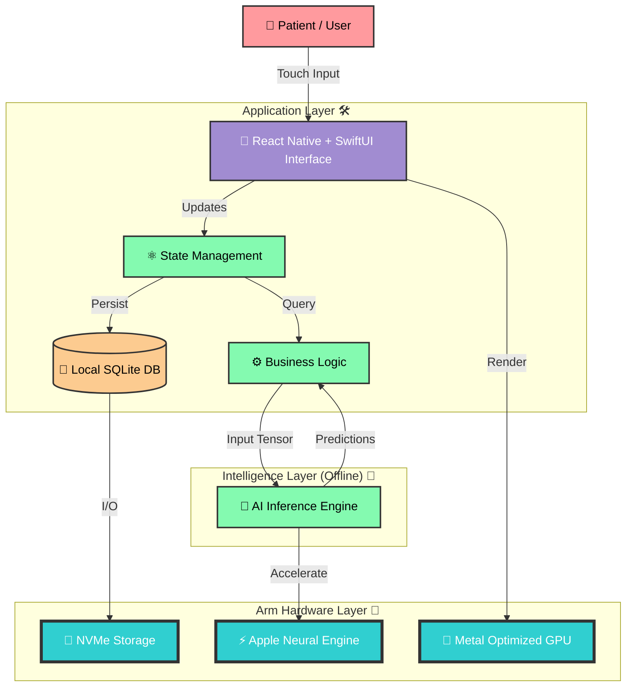
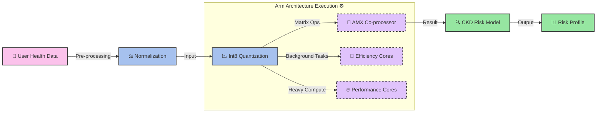
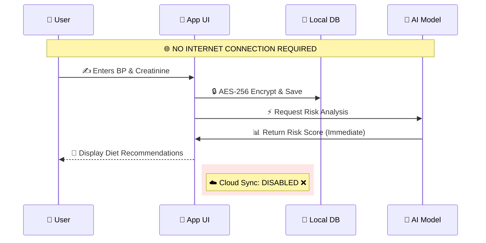
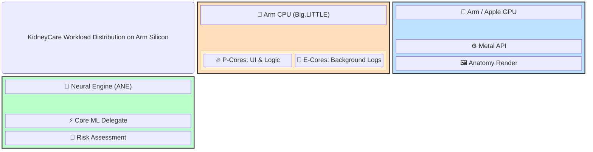
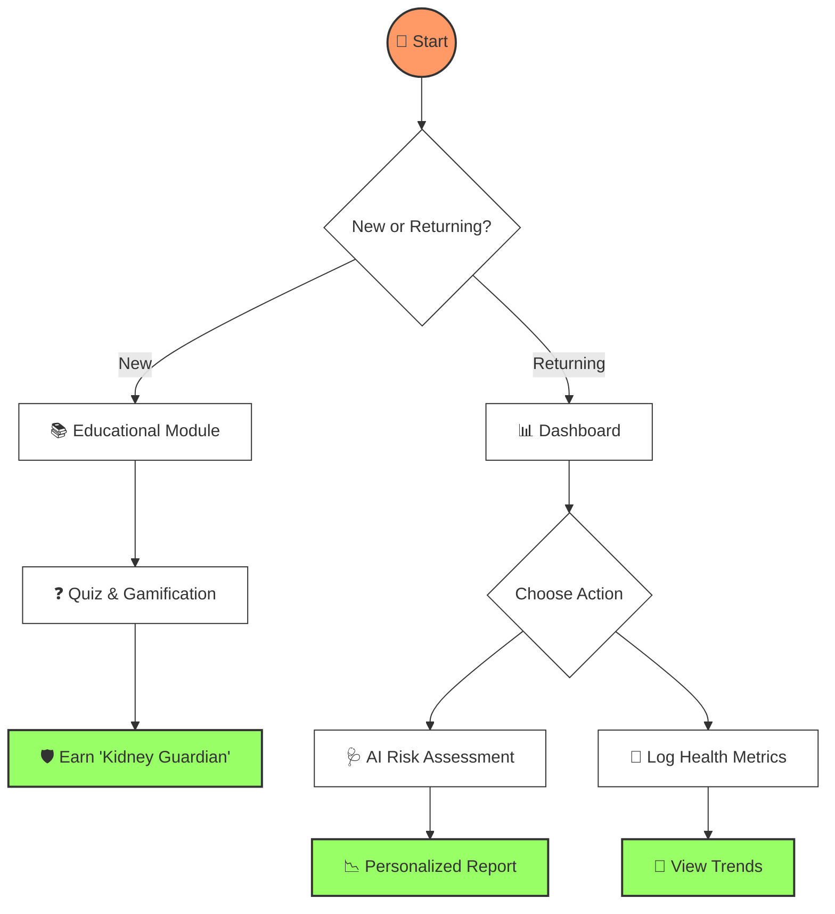

# 💧 KidneyCare: AI-Powered CKD Awareness & Prevention


> **"A Doctor in Your Pocket, Powered by Arm."** 🦾  
> *Empowering Sri Lankan communities with offline, AI-driven kidney health monitoring.* 🏥

---

## 📖 **Project Overview**

**KidneyCare** is a pioneering mobile health platform designed to combat the rising tide of **Chronic Kidney Disease (CKD)** and **CKDu** (Unknown etiology) in Sri Lanka. 🇱🇰

Optimized for **Arm-based iPads** (A14–M3), the application operates **100% offline** 🚫🌐, bringing critical diagnostics, education, and risk assessment to rural agricultural heartlands (like Rajarata) where internet connectivity is scarce but health risks are high.

### 🌟 **Why This Matters**
*   **The Problem 📉**: 1 in 8 adults in certain Sri Lankan provinces suffers from CKD. Early detection is rare due to lack of specialists.
*   **The Solution 💡**: An accessible, localized app that uses on-device AI to act as a first line of defense.
*   **The Tech ⚡**: Leveraging the power of **Apple Silicon (Arm architecture)** to run complex ML models without the cloud.

---

## 🚀 **Core Features**

| Feature | Description | Tech Used |
| :--- | :--- | :--- |
| **🧠 AI Risk Engine** | Instantly calculates CKD risk probability based on demographics & biomarkers. | `Core ML` `Decision Trees` |
| **🎨 Interactive Anatomy** | Real-time rendered 3D/2D diagrams of kidney function. | `Metal` `SVG` |
| **🥗 Localized Diet** | Advice tailored to Sri Lankan cuisine (e.g., *Kohila*, *Red Rice*, *Goraka*). | `Local DB` |
| **🎮 Gamified Learning** | Quizzes and badges ("Kidney Guardian" 🛡️) to drive engagement. | `React State` |
| **🩺 Lab Tracker** | Log Creatinine, eGFR, BP, and Urine Color over time. | `SQLite` |
| **🔒 Privacy First** | Zero data leaves the device. Your health data is yours alone. | `On-Device Storage` |

---

## 🏗️ **Technical Architecture**

KidneyCare is built as a **Hybrid Application**, combining the flexibility of React with the raw performance of native Arm hardware.

### **1. System Architecture Diagram** 🌈
*High-level view of how the application components interact.*



---

### **2. AI Processing Pipeline (Arm Optimized)** ⚡
*How we achieve real-time, offline AI inference without draining the battery.*



---

### **3. Privacy & Data Flow** 🔒
*Ensuring patient confidentiality through local-only processing.*



---

### **4. Arm Chip Utilization Block Diagram** 🔲
*Mapping KidneyCare features to specific silicon components.*



---

## ⚡ **How Arm Architecture is Used in KidneyCare**

KidneyCare utilizes the unique capabilities of Arm-based chips (A14–M3) to deliver a medical-grade experience on consumer hardware.

### **1. On-Device AI Processing 🧠**
*   **Mechanism**: The app offloads matrix multiplications to the **Apple Neural Engine (ANE)**.
*   **Benefit**: Enables real-time inference for our Risk Assessment AI (Transformers + Decision Trees) and generative illustrations.
*   **Result**: Zero latency, **100% offline capability**.

### **2. Performance Optimization 🚀**
*   **Mechanism**: Models are **quantized (int8/int4)**.
*   **Benefit**: Drastically reduces memory footprint and computation time.
*   **Result**: The app runs smoothly alongside other tasks, utilizing multi-core Arm CPUs for thread-balanced execution.

### **3. Energy Efficiency 🔋**
*   **Mechanism**: Heavy compute tasks are routed to **Performance Cores**, while background logging uses **Efficiency Cores**.
*   **Benefit**: Complex AI tasks do not drain the iPad battery.
*   **Result**: Health workers can use the device for full-day field visits in remote villages without recharging.

### **4. Seamless Integration (Core ML + Metal) 🖼️**
*   **Mechanism**: Direct access to the GPU via Metal for rendering educational 3D assets.
*   **Benefit**: High frame rates for interactive lessons and mini-games.
*   **Result**: An engaging, fluid user experience that feels premium and responsive.

---

## 🛤️ **User Journey Flow**



---

## 🛠 **Installation & Setup**

1.  **Clone the Repository**
    ```bash
    git clone https://github.com/senushidinara/KidneyCare-AI-Powered-CKD-Awareness-Detection-Prevention.git
    cd KidneyCare-AI-Powered-CKD-Awareness-Detection-Prevention
    ```

2.  **Install Dependencies**
    ```bash
    npm install
    ```

3.  **Run Development Server**
    ```bash
    npm start
    ```

4.  **Build for Production**
    ```bash
    npm run build
    # Deploys optimized assets for PWA / Capacitor wrapper
    ```

---

## 🏥 **Medical Disclaimer**
> *KidneyCare is a screening and education tool, not a diagnostic device. Always consult a qualified nephrologist for medical advice. In Sri Lanka, please visit your nearest MOH office or District Hospital for official testing.*

---

*Built with ❤️ for Sri Lanka.* 🇱🇰
