# 💧 KidneyCare: AI-Powered CKD Awareness & Prevention


> **"A Doctor in Your Pocket, Powered by Arm."**  
> *Empowering Sri Lankan communities with offline, AI-driven kidney health monitoring.* 🇱🇰

---

## 📖 **Project Overview**

**KidneyCare** is a pioneering mobile health platform designed to combat the rising tide of **Chronic Kidney Disease (CKD)** and **CKDu** (Unknown etiology) in Sri Lanka. 

Optimized for **Arm-based iPads**, the application operates **100% offline**, bringing critical diagnostics, education, and risk assessment to rural agricultural heartlands (like Rajarata) where internet connectivity is scarce but health risks are high.

### 🌟 **Why This Matters**
*   **The Problem**: 1 in 8 adults in certain Sri Lankan provinces suffers from CKD. Early detection is rare due to lack of specialists.
*   **The Solution**: An accessible, localized app that uses on-device AI to act as a first line of defense.
*   **The Tech**: Leveraging the power of **Apple Silicon (Arm architecture)** to run complex ML models without the cloud.

---

## 🚀 **Core Features**

| Feature | Description | Tech Used |
| :--- | :--- | :--- |
| **🧠 AI Risk Engine** | Instantly calculates CKD risk probability based on demographics & biomarkers. | `Core ML` `Decision Trees` |
| **🎨 Interactive Anatomy** | Real-time rendered 3D/2D diagrams of kidney function. | `Metal` `SVG` |
| **🥗 Localized Diet** | Advice tailored to Sri Lankan cuisine (e.g., *Kohila*, *Red Rice*, *Goraka*). | `Local DB` |
| **🎮 Gamified Learning** | Quizzes and badges ("Kidney Guardian") to drive engagement. | `React State` |
| **🩺 Lab Tracker** | Log Creatinine, eGFR, BP, and Urine Color over time. | `SQLite` |
| **🔒 Privacy First** | Zero data leaves the device. Your health data is yours alone. | `On-Device Storage` |

---

## 🏗️ **Technical Architecture**

KidneyCare is built as a **Hybrid Application**, combining the flexibility of React with the raw performance of native Arm hardware.

### **1. System Architecture**
*High-level view of how the application components interact.*

```mermaid
graph TD
    User[👤 Patient / User] -->|Touch Input| UI[📱 React Native + SwiftUI Interface]
    
    subgraph "Application Layer"
        UI -->|Updates| State[⚛️ State Management]
        State -->|Persist| DB[(💾 Local SQLite DB)]
        State -->|Query| Logic[⚙️ Business Logic]
    end

    subgraph "Intelligence Layer (Offline)"
        Logic -->|Input Tensor| AI_Engine[🧠 AI Inference Engine]
        AI_Engine -->|Predictions| Logic
    end

    subgraph "Hardware Layer (Arm Apple Silicon)"
        AI_Engine -->|Accelerate| ANE[⚡ Apple Neural Engine]
        UI -->|Render| GPU[🎨 Metal Optimized GPU]
        DB -->|I/O| SSD[💾 NVMe Storage]
    end
```



---

### **2. AI Processing Pipeline (Arm Optimized)**
*How we achieve real-time, offline AI inference without draining the battery.*

```mermaid
graph LR
    Data[📝 User Health Data] -->|Pre-processing| Norm[⚖️ Normalization]
    Norm -->|Input| Quant[📉 Int8 Quantization]
    
    subgraph "Arm Architecture Execution"
        Quant -->|Matrix Ops| AMX[🚀 AMX Co-processor]
        Quant -->|Background Tasks| E_Cores[🍃 Efficiency Cores]
        Quant -->|Heavy Compute| P_Cores[🔥 Performance Cores]
    end
    
    AMX -->|Result| Model[🔍 CKD Risk Model]
    Model -->|Output| Score[📊 Risk Profile]
```



---

### **3. Privacy & Data Flow**
*Ensuring patient confidentiality through local-only processing.*

```mermaid
sequenceDiagram
    participant User
    participant App_UI
    participant Local_Store
    participant AI_Model
    
    Note over User, AI_Model: 🌐 NO INTERNET CONNECTION REQUIRED
    
    User->>App_UI: Enters BP & Creatinine
    App_UI->>Local_Store: AES-256 Encrypt & Save
    App_UI->>AI_Model: Request Risk Analysis
    AI_Model->>App_UI: Return Risk Score (Immediate)
    App_UI-->>User: Display Diet Recommendations
    
    rect rgb(255, 240, 240)
        Note right of App_UI: ☁️ Cloud Sync: DISABLED
    end
```



---

## ⚡ **How Arm Architecture is Used in KidneyCare**

KidneyCare utilizes the unique capabilities of Arm-based chips (A14–M3) to deliver a medical-grade experience on consumer hardware.

### **1. On-Device AI Processing**
*   **Mechanism**: The app offloads matrix multiplications to the **Apple Neural Engine (ANE)**.
*   **Benefit**: Enables real-time inference for our Risk Assessment AI (Transformers + Decision Trees) and generative illustrations.
*   **Result**: Zero latency, 100% offline capability.

### **2. Performance Optimization**
*   **Mechanism**: Models are **quantized (int8/int4)**.
*   **Benefit**: Drastically reduces memory footprint and computation time.
*   **Result**: The app runs smoothly alongside other tasks, utilizing multi-core Arm CPUs for thread-balanced execution.

### **3. Energy Efficiency**
*   **Mechanism**: Heavy compute tasks are routed to **Performance Cores**, while background logging uses **Efficiency Cores**.
*   **Benefit**: Complex AI tasks do not drain the iPad battery.
*   **Result**: Health workers can use the device for full-day field visits in remote villages without recharging.

### **4. Seamless Integration (Core ML + Metal)**
*   **Mechanism**: Direct access to the GPU via Metal for rendering educational 3D assets.
*   **Benefit**: High frame rates for interactive lessons and mini-games.
*   **Result**: An engaging, fluid user experience that feels premium and responsive.

---

## 🛠 **Installation & Setup**

1.  **Clone the Repository**
    ```bash
    git clone https://github.com/yourusername/kidneycare.git
    cd kidneycare
    ```

2.  **Install Dependencies**
    ```bash
    npm install
    ```

3.  **Run Development Server**
    ```bash
    npm start
    ```

4.  **Build for Production**
    ```bash
    npm run build
    # Deploys optimized assets for PWA / Capacitor wrapper
    ```

---

## 🏥 **Medical Disclaimer**
> *KidneyCare is a screening and education tool, not a diagnostic device. Always consult a qualified nephrologist for medical advice. In Sri Lanka, please visit your nearest MOH office or District Hospital for official testing.*

---

*Built with ❤️ for Sri Lanka.*
